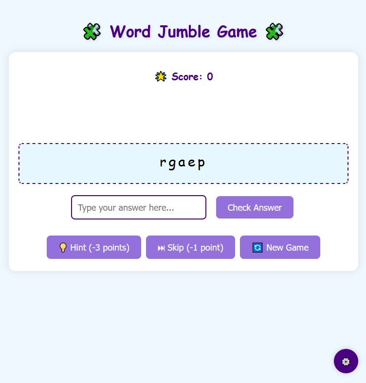

# Word-Jumble-Game-Optimized-version
# Word Jumble Game 🧩

A fun and interactive word puzzle game where players unscramble jumbled words to earn points. Customize the game with different categories and difficulty levels!

## Features ✨

- **Multiple Word Categories**: Choose from built-in categories (Animals, Fruits, Colors) or create your own
- **Adjustable Difficulty**: Three difficulty levels (Easy, Medium, Hard) based on word length
- **Score System**: Earn points for correct answers, lose points for hints/skips
- **Hint System**: Get help when stuck (costs 3 points)
- **Custom Words**: Add your own word lists for personalized gameplay
- **Password Protection**: Secure your custom categories with a password
- **Responsive Design**: Works on desktop and mobile devices

## How to Play 🎮

1. **Start Playing**: The game begins automatically with default settings
2. **Unscramble Words**: Type your answer in the input box and press Enter/Submit
3. **Use Hints**: Click the hint button if you need help (costs 3 points)
4. **Skip Words**: Can't figure it out? Skip to the next word (costs 1 point)
5. **Adjust Settings**: Click the ⚙️ icon to change game options

## Game Settings ⚙️

Access settings by clicking the gear icon in the bottom-right corner:

- **Difficulty Level**:
  - Easy: 3-5 letter words
  - Medium: 6-8 letter words (default)
  - Hard: 9+ letter words

- **Word Categories**:
  - Choose from existing categories
  - Create and manage custom categories

- **Custom Words**:
  - Enter comma-separated words for personal word banks
  - Save your custom lists for future games

## Category Management 📁

Password-protected category management allows you to:

- Add new categories
- Edit existing word lists
- Delete unwanted categories
- Rename categories

Default password: `admin123` (change it in settings)

## Scoring System 📊

- Correct answer: +10 points
- Hint: -3 points
- Skip: -1 point

## Technical Details 💻

- Pure HTML/CSS/JavaScript - no frameworks or dependencies
- Data saved in browser's localStorage
- Responsive design works on all screen sizes

## How to Install 🛠️

Simply download the `index.html` file and open it in any modern web browser! No server or additional files required.

## Future Improvements 🚀

- [ ] Add timer mode
- [ ] Implement multiplayer functionality
- [ ] Add sound effects
- [ ] Create difficulty-based scoring
- [ ] Add animations for correct/incorrect answers

## Credits 🙏

Developed by Cathy using:
- [Comic Sans MS](https://www.fonts.com/font/microsoft-corporation/comic-sans) for the fun font style
- Color palette inspired by [Coolors](https://coolors.co/)

---

Enjoy the game! 🎉 For any questions or suggestions, please open an issue in this repository.
